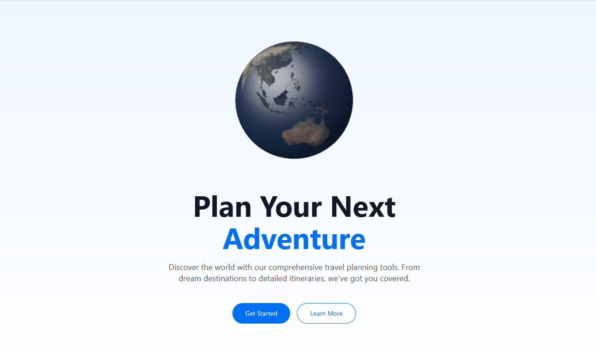

# Travel Planner

A modern travel planning application built with Next.js and Tailwind CSS, featuring AI-powered itinerary generation using Google's Gemini API.



## Features

- Trip Management
- Destination Explorer
- AI-Generated Itineraries with Gemini 1.5 Pro/2.5 Flash
- Social feed for travel posts
- User Profiles
- Authentication (mock system for demo)
- Save and edit itineraries
- Google Maps integration
- Responsive design for all devices

## Getting Started

1. Clone this repository:
```bash
git clone https://github.com/yourusername/travel-planner.git
cd travel-planner
```

2. Install dependencies:
```bash
npm install
```

3. Set up your environment variables:
   - Create a file named `.env.local` in the root directory
   - Get a Gemini API key from [Google AI Studio](https://aistudio.google.com/app/apikey)
   - Add your key to `.env.local`: `NEXT_PUBLIC_GEMINI_API_KEY=your_key_here`

4. Run the development server:
```bash
npm run dev
```

5. Open [http://localhost:3000](http://localhost:3000) with your browser to see the result.

## Deployment

This project can be easily deployed to Vercel:

1. Push your repository to GitHub
2. Visit [Vercel](https://vercel.com) and import your repository
3. Set the environment variable `NEXT_PUBLIC_GEMINI_API_KEY` in the Vercel dashboard
4. Deploy

## Test Account

For testing purposes, you can use:
- Email: test@example.com
- Password: password123

## Gemini API Integration

This project uses the latest Gemini API format with the `@google/genai` package. The itinerary generator leverages the Gemini 2.5 Flash model to create personalized travel itineraries based on:

- Destination
- Travel dates
- Number of travelers
- Personal interests
- Budget preferences
- Additional custom requests

The API creates a structured JSON response with daily activities, restaurant recommendations, and travel tips.

## Project Structure

- `/app` - Main application directory
  - `/components` - Reusable components
  - `/feed` - Social feed functionality
  - `/itinerary` - AI itinerary generation
  - `/login` & `/register` - Authentication pages
  - `/profile` - User profile pages
  - `/utils` - Utility functions including Gemini API integration
  - `layout.js` - Root layout component
  - `page.js` - Home page
  - `globals.css` - Global styles

## Technologies Used

- Next.js 14
- React 18
- Tailwind CSS
- Three.js (for 3D globe)
- Framer Motion
- Google Generative AI (Gemini 2.5 Flash)
- Local Storage for saving itineraries

## Contributing

Contributions are welcome! Please feel free to submit a Pull Request.

## License

This project is licensed under the MIT License - see the LICENSE file for details. 